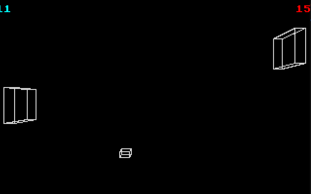

# Lockbox

This is a fun game meant to run in DOS made for Hack Club Retrospect!

The build uses DOSBox, so you'll have to enter commands manually or modify the `Makefile` if you are using a different emulator.

`make dev` will automatically run the program in `dosbox`.
Path variables and libraries should be automatically loaded.

`make build` will build the executable at `out\main.exe`.
If you run into the error `Load eror: no DPMI - Get csdpmi*b.zip`,
add the directory `out\cwsdpmi\bin` to your path.

`make box` will initialize the container with the correct path and environment variables,
making it good for repeated recompilations or checkig error messages.
